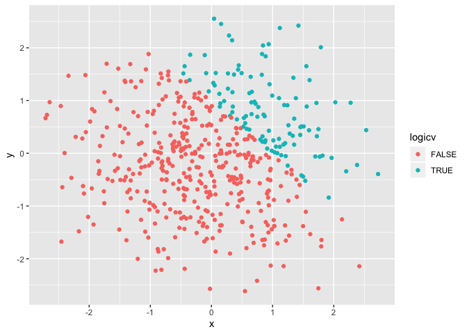
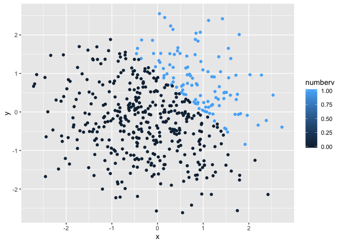
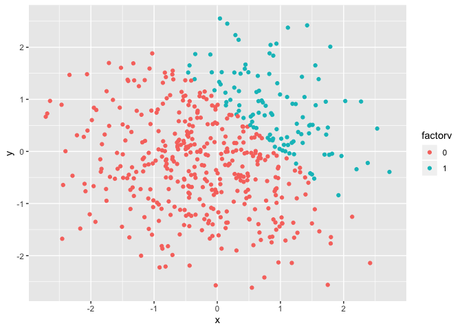

P8105\_hw1\_sim2128
================
Sarah Munro
2019-09-20

    ## ── Attaching packages ───────────────────────────────────────────────────────────────────────────────── tidyverse 1.2.1 ──

    ## ✔ ggplot2 3.2.1     ✔ purrr   0.3.2
    ## ✔ tibble  2.1.3     ✔ dplyr   0.8.3
    ## ✔ tidyr   0.8.3     ✔ stringr 1.4.0
    ## ✔ readr   1.3.1     ✔ forcats 0.4.0

    ## ── Conflicts ──────────────────────────────────────────────────────────────────────────────────── tidyverse_conflicts() ──
    ## ✖ dplyr::filter() masks stats::filter()
    ## ✖ dplyr::lag()    masks stats::lag()

**Problem 1**

``` r
set.seed(10)
hw1_df = tibble(
  sharks = rnorm(8),
  positive = sharks > 0, 
  species = c("White", "Tiger", "Nurse", "Bull", "Whale", "Lemon", "Hammerhead",   "Mako"),
  aggression = factor(c("High", "High", "Low", "High", "Low", "High", "Medium", "Medium"))
)

mean(pull(hw1_df, sharks))
```

    ## [1] -0.3779272

``` r
#The mean was taken properly
mean(pull(hw1_df, positive))
```

    ## [1] 0.375

``` r
#The mean was taken properly
mean(pull(hw1_df, species))
```

    ## Warning in mean.default(pull(hw1_df, species)): argument is not numeric or
    ## logical: returning NA

    ## [1] NA

``` r
#The mean was unable to be taken
mean(pull(hw1_df, aggression))
```

    ## Warning in mean.default(pull(hw1_df, aggression)): argument is not numeric
    ## or logical: returning NA

    ## [1] NA

``` r
#The mean was unable to be taken
```

``` r
#Convert the logical vector to a numeric vector
as.numeric(pull(hw1_df, positive))
#Convert the character vector to a numeric vector
as.numeric(pull(hw1_df, species))
#Convert the factor vector to a numeric vector
as.numeric(pull(hw1_df, aggression))

#You can convert the logical and factor vectors to numeric, but you are unable to covert the character vector to numeric. This would explain why the mean of the character variable cannot be taken, the characters do not correspond to any numeric values. 
```

``` r
#Convert the logical vector to a numeric vector, then multiply the random sample by the result
as.numeric(pull(hw1_df, positive))*(pull(hw1_df, sharks))
```

    ## [1] 0.01874617 0.00000000 0.00000000 0.00000000 0.29454513 0.38979430
    ## [7] 0.00000000 0.00000000

``` r
#Convert the logical vector to a factor vector, then multiply the random sample by the result
as.factor(pull(hw1_df, positive))*(pull(hw1_df, sharks))
```

    ## Warning in Ops.factor(as.factor(pull(hw1_df, positive)), (pull(hw1_df,
    ## sharks))): '*' not meaningful for factors

    ## [1] NA NA NA NA NA NA NA NA

``` r
#Convert the logical vector to a factor factor, then convert the result to numeric, then multiply the random sample by the result
as.numeric(as.factor(pull(hw1_df, positive)))*(pull(hw1_df, sharks))
```

    ## [1]  0.03749234 -0.18425254 -1.37133055 -0.59916772  0.58909025  0.77958860
    ## [7] -1.20807618 -0.36367602

``` r
#The result was not meaningful for the factors, they were assigned values of NA
```

**Problem 2**

``` r
set.seed(500)
part2_df = tibble(
  x = rnorm(500),
  y = rnorm(500),
  logicv = x + y > 1,
  numberv = as.numeric(logicv),
  factorv = as.factor(numberv)
)
```

The dataset `part2_df1` has 500 rows and 5 columns. The mean of x is
-0.0455615, the median is -0.0385267, and the standard deviation is
1.0165813. The proportion of `logicv` for which x + y \> 1 is 0.22

``` r
#Scatter plot with colors corresponding to the logical vector
ggplot(part2_df, aes(x = x, y = y, color=logicv)) + geom_point()
```

<!-- -->

``` r
ggsave("scatter_plot1.pdf")
```

    ## Saving 7 x 5 in image

``` r
#Scatter plot with colors corresponding to the numeric vector
ggplot(part2_df, aes(x = x, y = y, color=numberv)) + geom_point()
```

<!-- -->

``` r
#Scatter plot with colors corresponding to the factor vector
ggplot(part2_df, aes(x = x, y = y, color=factorv)) + geom_point()
```

<!-- -->

``` r
#The distribution appeared the same for all three plots. The colors appeared the same only for the plots corresponding to the logical and factor vector. For the plot with colors corresponding to the numeric vector, there was a scale of color rather than 2 single options of red or blue. 
```
